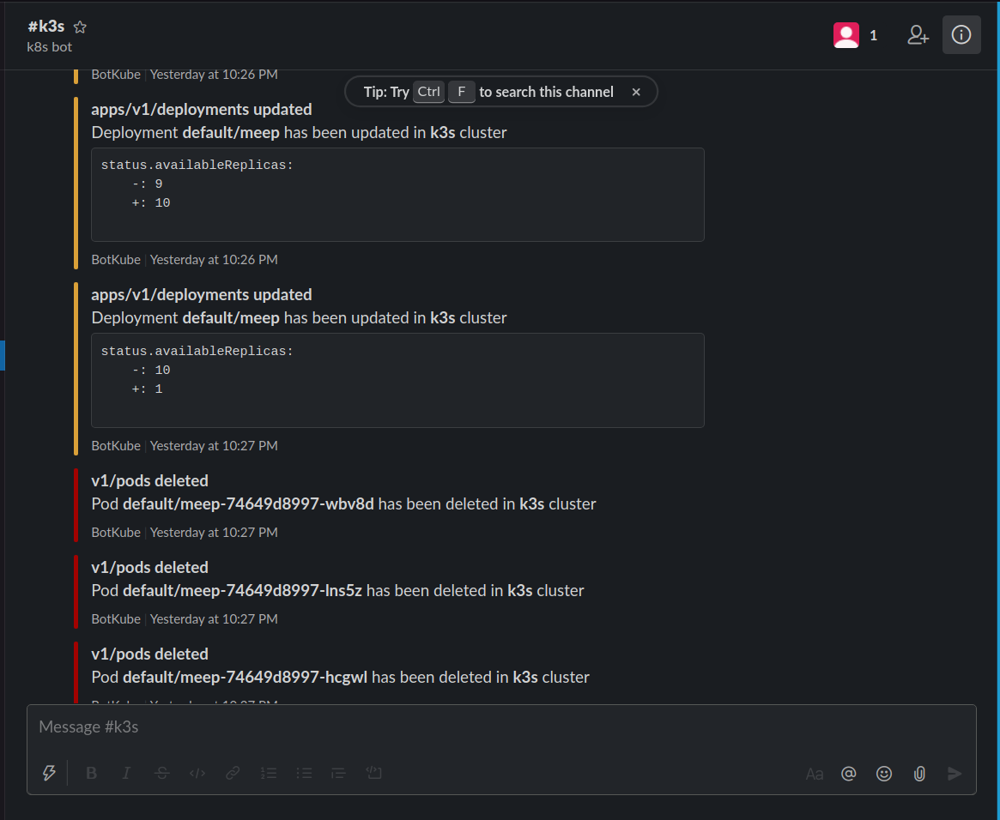

# Monitoring

## botkube

BotKube integration with Slack, Mattermost or Microsoft Teams helps you monitor your Kubernetes cluster, debug critical deployments and gives recommendations for standard practices by running checks on the Kubernetes resources. You can also ask BotKube to execute kubectl commands on k8s cluster which helps debugging an application or cluster.

https://github.com/infracloudio/botkube

